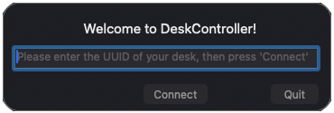

# DeskController Menu Bar App

**Version:** v1.1.1

DeskController is a lightweight macOS menu bar application for controlling Linak-based standing desks. DeskController provides a visual interface for linak-controller interactions, allowing bluetooth desk height control.


### Requirements

- macOS 14 Sonoma or later
- [Homebrew](https://brew.sh)
- A Linak-based desk already paired to your Mac via Bluetooth

DeskController is distributed as a signed, notarized app bundle through a Homebrew cask. Installing the cask automatically pulls in the [linak-controller](https://github.com/rhyst/linak-controller) CLI and all of its dependencies, so you do **not** need to install Python, PyObjC, or anything else yourself.


### Compatibility

The App is only tested on Apple Silicon Macs with macOS Tahoe. DeskController is built on top of [linak-controller](https://github.com/rhyst/linak-controller), an open-source project for controlling Linak standing desk controllers via Bluetooth. Although the cask and DeskController's in-app settings are designed to automatically handle the linak-controller dependency and its configuration, these can still be the cause of issues (more on this under [Troubleshooting](#troubleshooting)).

 Compatible Desks reported by linak-controller:
- Ikea Idasen
- iMovr Lander
- Linak DPG1C
- Linak DPG1M

## Quick Start

1. **Install via Homebrew**:

   ```bash
   brew install --cask victor-hucklenbroich/tap/desk-controller
   ```

   This installs DeskController into `/Applications` and automatically pulls in the `linak-controller` CLI and its dependencies.

2. **Launch the App**:

   Open `/Applications/DeskController.app`, or run:

   ```bash
   open -a DeskController
   ```

3. **Enter your desks UUID**:

  

4. **Control your desk!**

 

### Build from source

Developers can build locally instead of using the cask:

```bash
git clone https://github.com/victor-hucklenbroich/desk-controller.git
cd desk-controller
pyinstaller app.spec
```


## Troubleshooting
If something goes wrong during installation, check the output of `brew install` to find the issue. A likely culprit is a missing or outdated Homebrew installation. The linak-controller dependency should be handled automatically, but it's worth checking it manually if necessary. 


If the DeskController App is not launching properly there is a prelaunch error log available at `~/Library/Logs/DeskController_error.log`. Most common issues are problems with linak-controller and its config, the provided UUID of your desk, or the Bluetooth connection between your Mac and desk. Before proceeding double check that DeskController can find your linak-controller path and config file (`~/Library/Application Support/linak-controller/config.yaml`). This is where DeskController is looking for the UUID of your desk. Also make sure the UUID is correct, and you can connect to your desk via Bluetooth.  If you are still facing issues, check the runtime logs located at `~/Library/Logs/DeskController.log`. At this point you might also want to check the DeskController and linak-controller source code.

## Uninstall

Remove DeskController with Homebrew:

```bash
brew uninstall --cask desk-controller
```

To also delete its configuration and logs, add `--zap`:

```bash
brew uninstall --zap --cask desk-controller
```

## Acknowledgements

- Built with [linak-controller](https://github.com/rhyst/linak-controller) by [rhyst](https://github.com/rhyst)
