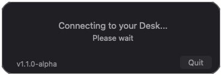
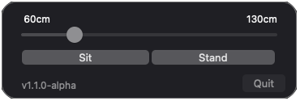
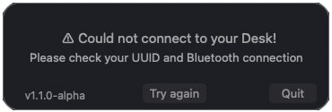

# DeskController Menu Bar App

**Version:** v1.1.0-alpha

DeskController is a lightweight macOS menu bar application for controlling Linak-based standing desks. DeskController provides a visual interface for linak-controller interactions, allowing bluetooth desk height control.


### Requirements

- macOS 14 Sonoma or later
- Python 3.x
- PyObjC (for macOS native UI)
- Homebrew (recommended for linak-controller installation)
- linak-controller
- Desk already paired to your device.

The [install](./install) script will automatically check for a valid Python installation and install Homebrew, PyObjc and linak-controller if they aren't already available. So you only need to pair your Desk if you are following the [Quick Start](#quick-start) guide.


### Compatibility

The App is only tested on Apple Silicon Macs with macOS Tahoe, but there isn't be any reason why it should not work with older versions of macOS or Intel Macs. Further, DeskController is built on top of [linak-controller](https://github.com/rhyst/linak-controller), an open-source project for controlling Linak standing desk controllers via Bluetooth. Althought the installation script and DeskController in-app settings are designed to automatically handle the linak-controller dependency and its configuration, these can still be the cause of issues (more on this under [Troubleshooting](#troubleshooting)).

 Compatible Desks reported by linak-controller:
- Ikea Idasen
- iMovr Lander
- Linak DPG1C
- Linak DPG1M

## Quick Start
1. **Clone the repository**:
   ```bash
   git clone git@github.com:victor-hucklenbroich/desk-controller.git
   ```
   or
   ```bash
   git clone https://github.com/victor-hucklenbroich/desk-controller.git
   ```

2. **Navigate to the local repository**:

   ```bash
   cd desk-controller
   ```

3. **Run the installation script**:

   (Note: this step might ask you to automatically install the dependencies)
   ```bash
   ./install
   ```
   
4. **Launch the App**:

   `/Applications/DeskController.app`
 
 


## Troubleshooting
Should something go wrong during the execution of the installation script, it's recommended to follow the scripts outputs to find the issue. Likely culprits are a missing, invalid or outdated installation of Python or Homebrew. The linak-controller and PyObjC dependencies should be handled automatically by the script but it's worth checking these manually if necessary. 




If the DeskController App is not launching properly there is a prelaunch error log available at `~/Library/Logs/DeskController_error.log`. Most common issues are problems with linak-controller and its config, the provided UUID of your desk, or the Bluetooth connection between your Mac and desk. Before proceeding double check that DeskController can find your linak-controller path and config file (`~/Library/Application Support/linak-controller/config.yaml`). This is where DeskController is looking for the UUID of your desk. Also make sure the UUID is correct, and you can connect to your desk via Bluetooth.  If you are still facing issues, check the runtime logs located at `~/Library/Logs/DeskController.log`. At this point you might also want to check the DeskController and linak-controller source code.

## Uninstall
If you do not like DeskController you can remove it easily with the [uninstall](./uninstall) script, analogous in execution to the install script. This will only leave the cloned repository, which you can delete manually.

## Acknowledgements

- Built with [linak-controller](https://github.com/rhyst/linak-controller) by [rhyst](https://github.com/rhyst)
