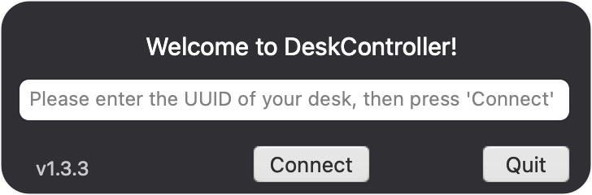
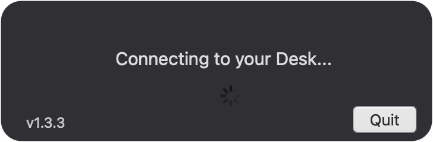
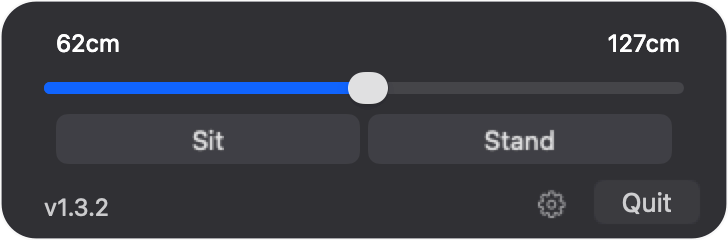
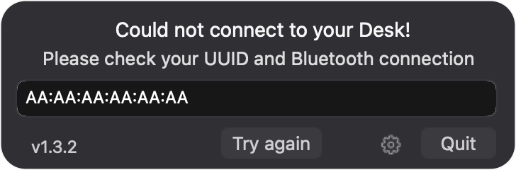

# DeskController Menu Bar App

DeskController is a lightweight macOS menu bar application for controlling Linak-based standing desks. DeskController talks to the desk directly over Bluetooth (BLE) and keeps a persistent connection in the background.


### Requirements

- macOS 14 Sonoma or later
- [Homebrew](https://brew.sh)
- A Linak-based desk already paired to your Mac via Bluetooth

DeskController is distributed as a signed, notarized, fully self-contained app bundle through a Homebrew cask.


### Compatibility

DeskController ships as a universal binary and runs natively on both Apple Silicon and Intel Macs. It is primarily tested on Apple Silicon Macs with macOS Tahoe and an Ikea Idasen. 

DeskController's Bluetooth communication layer is based on [linak-controller](https://github.com/rhyst/linak-controller), an open-source project for controlling Linak standing desk controllers via Bluetooth.

 Compatible Desks reported by linak-controller:
- Ikea Idasen
- iMovr Lander
- Linak DPG1C
- Linak DPG1M

## Quick Start

1. **Install via Homebrew**:

   ```bash
   brew install --cask victor-hucklenbroich/tap/desk-controller
   ```

   This installs DeskController into `/Applications`.

2. **Launch the App**:

   Open `/Applications/DeskController.app`, or run:

   ```bash
   open -a DeskController
   ```

3. **Enter your desks UUID**:

 

4. **Control your desk!**



### Build from source

Developers can build locally instead of using the cask. The quickest path is a plain PyInstaller build for your machine's architecture:

```bash
git clone https://github.com/victor-hucklenbroich/desk-controller.git
cd desk-controller
pip install pyinstaller -r requirements.txt
pyinstaller app.spec
```

For a local build that also matches a release's appearance, run `packaging/dev/build.sh`. It builds for your architecture, pins the linked SDK so the AppKit appearance is deterministic, and ad-hoc signs the bundle with the release entitlements, so it needs no Developer ID certificate:

```bash
./packaging/dev/build.sh
```

Release builds (`packaging/release/build.sh`) run the same core process, then add the distribution-only steps: they are universal2, and additionally Developer ID signed, notarized and stapled. Reproducing one requires a universal2 Python (e.g. from python.org) and a pure-Python PyYAML, in a venv of its own:

```bash
/Library/Frameworks/Python.framework/Versions/3.13/bin/python3.13 -m venv .venv-build
source .venv-build/bin/activate
pip install pyinstaller -r requirements.txt
# PyYAML publishes single-arch wheels, rebuild it without the libyaml C extension
PYYAML_FORCE_LIBYAML=0 pip install --no-binary PyYAML --force-reinstall --no-cache-dir --no-deps PyYAML
./packaging/release/build.sh
```

Both scripts pick up `.venv-build` automatically. Do not build from a venv shared with other projects: anything that reinstalls PyYAML there drops a single-arch `_yaml*.so` back in, and PyInstaller then fails with `IncompatibleBinaryArchError: ... is not a fat binary!`. The `--force-reinstall` above is what makes the command fix such a venv instead of skipping PyYAML as already satisfied.


## Troubleshooting
If something goes wrong during installation, check the output of `brew install` to find the issue. A likely culprit is a missing or outdated Homebrew installation.



If the DeskController App is not launching properly there is a prelaunch error log available at `~/Library/Logs/DeskController_error.log`. Most common issues are a wrong desk UUID, a missing Bluetooth permission for DeskController (System Settings → Privacy & Security → Bluetooth), or the Bluetooth connection between your Mac and desk. The desk UUID and presets are stored in the config file at `~/Library/Application Support/DeskController/config.yaml`. Also make sure the UUID is correct, and you can connect to your desk via Bluetooth. If you are still facing issues, check the runtime logs located at `~/Library/Logs/DeskController.log`.

## Uninstall

Remove DeskController with Homebrew:

```bash
brew uninstall --cask desk-controller
```

To also delete its configuration and logs, add `--zap`:

```bash
brew uninstall --zap --cask desk-controller
```

## Acknowledgements

- The Bluetooth communication layer is adapted from [linak-controller](https://github.com/rhyst/linak-controller) by [rhyst](https://github.com/rhyst)
